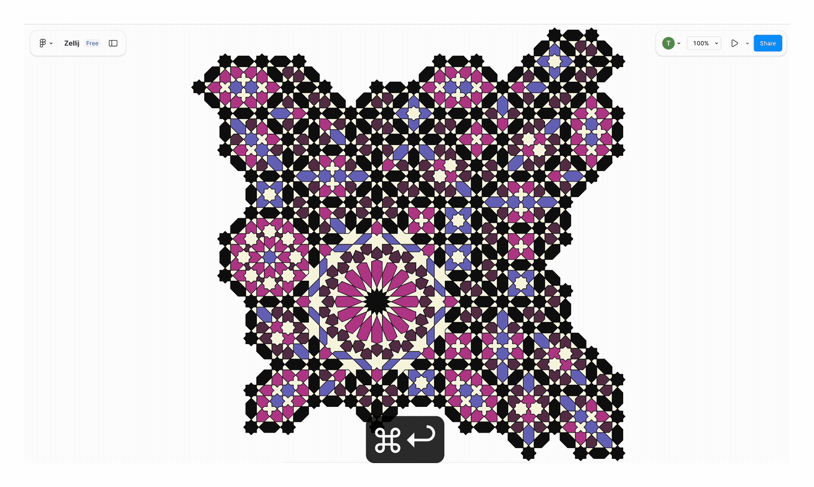

# GenerativeZellij

Here's an example of generated Zellij patterns running directly on a Figma canvas.

Thread with more details: https://x.com/taziksh/status/1985879808027598901

Adapted from Professor Eric Kaplan's https://isohedral.ca/generative-zellij/
